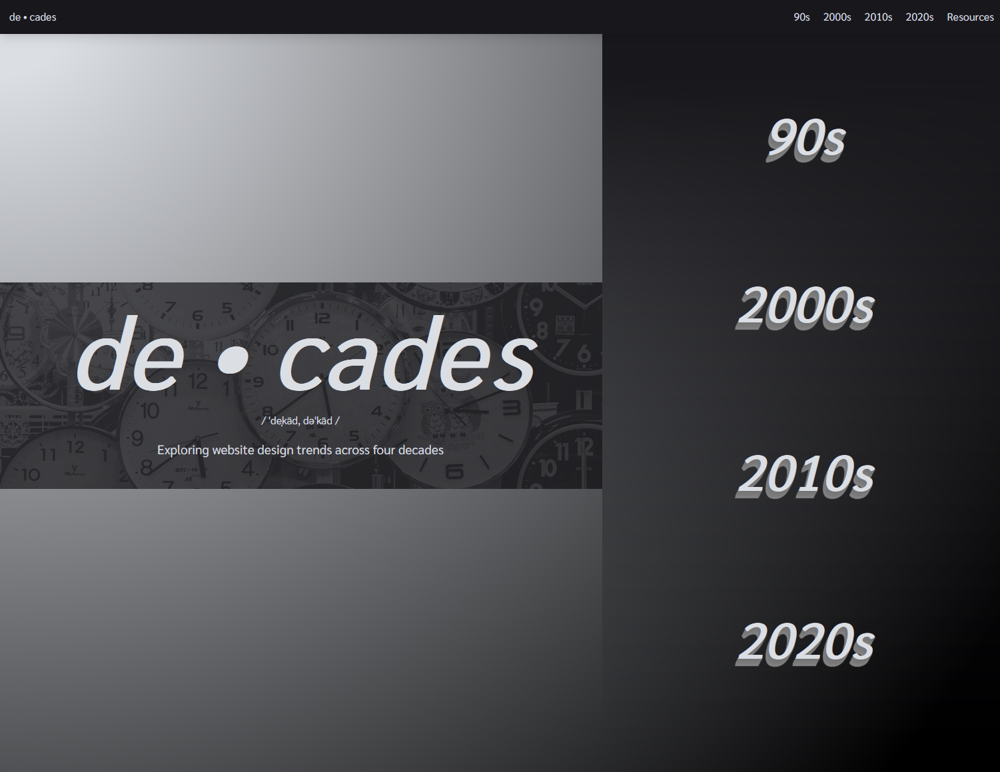

# Decades

Web pages exploring the evolution of website design trends across the 90s, 2000s, 2010s, and 2020s.

_This was an assignment for Lindenwood University's Fundamentals of HTML course (2024)._

## Table of Contents

- [Overview](#overview)
- [Technologies Used](#technologies-used)
- [Future improvements](#future-improvements)
- [Screenshots](#screenshots)

## Overview

This project was a homework assignment for Lindenwood University's _Fundamentals of HTML_ course (2024). The requirements for this assignment goes as follows:

- 6 HTML Pages
- No JavaScript
- No networking, HTTP requests, etc
- 1 style.css file

While the assignment had a few requirements, the overall concept was up to us. I chose to make a few webpages that highlighted web design trends across four decades of web design. The landing page would serve as the introduction and overview for the concept, one page would be dedicated to resources and citations, meanwhile the other 4 pages would each exemplify trends for a corresponding decade. In part due to the requirements of the homework, I chose to limit the focus on HTML and CSS only despite the fact that technologies such as Flash and JavaScript have been integral in defining trends throughout.

## Technologies Used

- HTML5
- CSS3

## Future improvements

- Complete first draft of 2020s page
- Test and modify for responsiveness (only tested on one screen size at the moment)
- Refactor and abstract style.css into separate files
- Continue research and correct falsities
- Add all citations of images and sources used throughout project
- Get screenshots that include mouse cursor where relevant (snipping tool doesn't support this feature yet)
- Deploy

## Screenshots

### Home

### Home #2 (scrolled down)

### Home #3 (scrolled down)

### Home #4 (scrolled down)

### Home #5 (scrolled down)

### 1990s Page

### 2000s Page

### 2010s Page

### 2010s Page #2 (scrolled down)

### 2010s Page #3 (scrolled down)

### 2010s Page #4 (scrolled down)

### 2010s Page #5 (scrolled down)

### Resources Page

